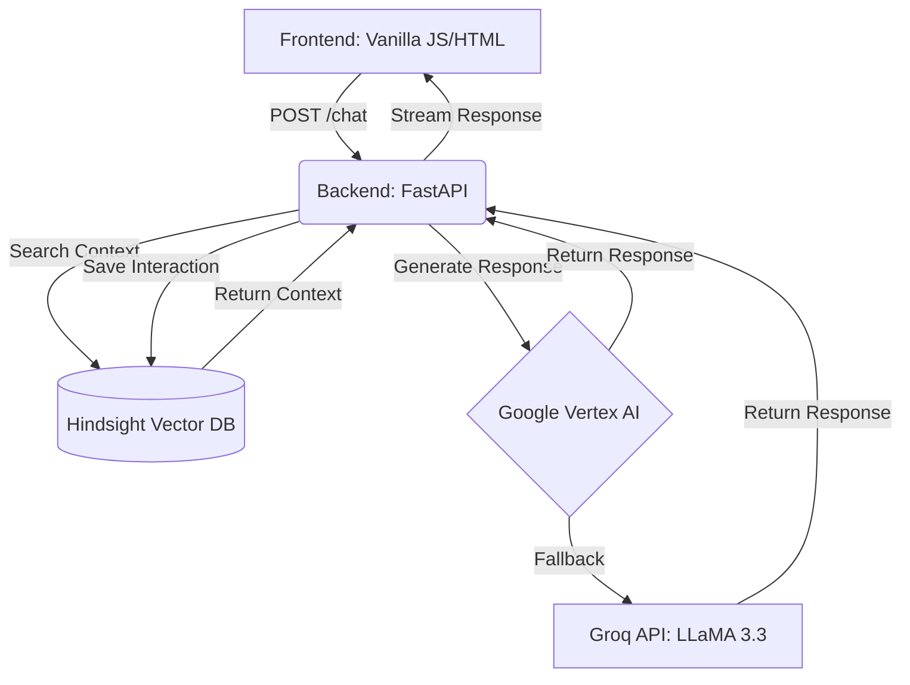

<div align="center">
  
  
  # 🗳️ ElectionGuide
  
  **An Intelligent, Interactive Voting Assistant powered by AI & Vector Search**

  [](https://fastapi.tiangolo.com/)
  [](https://python.org)
  [](https://cloud.google.com/run)
  [](https://www.docker.com/)

  *Demystifying the democratic process, one question at a time.*
</div>

---

## 🌟 What Is ElectionGuide?

ElectionGuide is a **production-ready, full-stack AI assistant** engineered to help voters easily navigate the complexities of election timelines, registration deadlines, and voting procedures. 

Instead of searching through dense government websites, users can simply ask questions in plain English and receive **step-by-step, neutrally formatted guidance**.

### ✨ Key Features

- **🗣️ Natural Language Processing:** Understands complex voter queries in plain English.
- **📅 Smart Timeline Formatting:** Automatically organizes key dates and deadlines into clean Markdown tables.
- **🧠 Stateful Semantic Memory:** Powered by **Hindsight Vector Database** to remember conversation context.
- **🛡️ High Availability:** Dual-memory failover and automatic fallback from **Vertex AI** to **Groq**.
- **🔒 Enterprise Security:** Runs as a non-root Docker user, with strict CORS policies and hidden API keys.

---

## 🏗️ Architecture & Tech Stack

<details>
<summary><b>Click to view Architecture Diagram</b></summary>



</details>

### 🛠️ Core Technologies
| Component | Technology | Purpose |
| :--- | :--- | :--- |
| **Backend** | `FastAPI` + `Uvicorn` | High-performance async API routing & static serving. |
| **AI Engine** | `Vertex AI` & `Groq` | Generates context-aware, neutral responses. |
| **Vector DB** | `Hindsight API` | Stores and retrieves semantic memory of past user questions. |
| **Frontend** | `HTML5`, `CSS3`, `JS` | Glassmorphism UI with fully accessible ARIA integration. |
| **DevOps** | `Docker`, `Google Cloud Run`| Containerized for isolated, secure, and scalable cloud deployment. |

---

## 🚀 Getting Started

### Prerequisites
- **Python 3.10+**
- A [Groq API Key](https://console.groq.com/keys) (Free)
- *(Optional)* [Hindsight API Key](https://vectorize.io/) for persistent semantic memory.

### 💻 Local Installation

1. **Clone the repository**
   ```bash
   git clone https://github.com/Venkateswaran07/costumer_support_Ai.git
   cd costumer_support_Ai
   ```

2. **Install dependencies**
   ```bash
   pip install -r backend/requirements.txt
   ```

3. **Configure Environment**
   Create a `.env` file in the root directory:
   ```env
   GROQ_API_KEY=your_groq_api_key_here
   HINDSIGHT_API_KEY=your_hindsight_key_here
   # GEMINI_API_KEY=your_gemini_key_here (Optional)
   ```

4. **Run the Application**
   ```bash
   cd backend
   uvicorn main:app --reload
   ```
   *Navigate to `http://127.0.0.1:8000` in your browser.*

---

## ☁️ Cloud Deployment (Google Cloud Run)

This project is fully containerized and optimized for Google Cloud Run. It uses a custom `Dockerfile` with a non-root `appuser` for maximum security.

```bash
# Deploy directly from source
gcloud run deploy election-assistant \
  --source . \
  --region us-central1 \
  --allow-unauthenticated \
  --clear-base-image \
  --set-env-vars "GROQ_API_KEY=your_key,HINDSIGHT_API_KEY=your_key"
```

---

## 🧪 Testing

The backend includes a comprehensive testing suite built with `pytest` and `pytest-mock` to ensure API reliability.

```bash
cd backend
pytest test_main.py -v
```

---

## 🤝 Contributing

Contributions, issues, and feature requests are welcome!
Feel free to check the [issues page](https://github.com/Venkateswaran07/costumer_support_Ai/issues).

---

<div align="center">
  <i>Built with ❤️ by <a href="https://github.com/Venkateswaran07">Venkateswaran</a>.</i>
</div>
