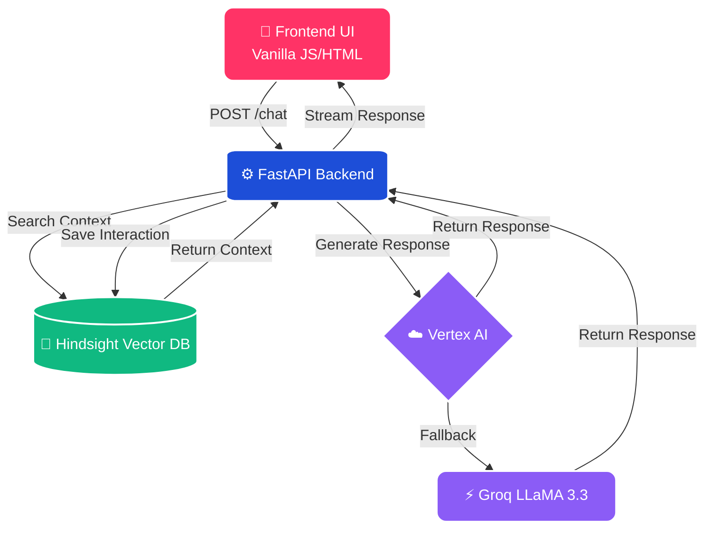

<div align="center">


[](https://fastapi.tiangolo.com/)
[](https://python.org)
[](https://cloud.google.com/run)
[](https://www.docker.com/)

<br/>

**Demystifying the democratic process, one question at a time.** 🇺🇸✨

[Explore Features](#-features) • [Installation](#-getting-started) • [Cloud Deployment](#-cloud-deployment) • [Architecture](#-architecture)

</div>

---

<br/>

## 🎯 The Vision

Navigating election timelines, voter ID requirements, and registration steps shouldn't feel like decoding a legal document. **ElectionGuide** is a premium, AI-powered interactive assistant designed to provide **step-by-step, neutrally formatted guidance** to voters.

Instead of scrolling through dense PDF files, users can simply ask questions in plain English and receive instant, personalized answers formatted with beautiful Markdown tables and actionable bullet points.

<br/>

## ✨ Features

<table>
  <tr>
    <td align="center" width="50%">
      <h3>🗣️ Natural Language Processing</h3>
      <p>Understands complex voter queries in plain English. No rigid keywords required.</p>
    </td>
    <td align="center" width="50%">
      <h3>📅 Smart Timelines</h3>
      <p>Automatically organizes key dates and deadlines into clean, scannable Markdown tables.</p>
    </td>
  </tr>
  <tr>
    <td align="center" width="50%">
      <h3>🧠 Semantic Memory</h3>
      <p>Powered by <b>Hindsight Vector DB</b>. It remembers what you asked earlier in the session.</p>
    </td>
    <td align="center" width="50%">
      <h3>🛡️ High Availability</h3>
      <p>Dual-memory failover and automatic fallback from <b>Vertex AI</b> to <b>Groq LLaMA 3.3</b>.</p>
    </td>
  </tr>
</table>

<br/>

## 🏗️ Architecture 

> **ElectionGuide** uses a modern, robust microservice architecture deployed in an isolated container.

<details open>
<summary><b>🗺️ System Flow Diagram</b></summary>
<br/>



</details>

<br/>

## 📂 Project Structure

```text
📦 costumer_support_Ai
 ┣ 📂 frontend
 ┃ ┣ 📜 index.html        # Glassmorphism UI
 ┃ ┣ 📜 app.js            # Client-side API fetch logic
 ┃ ┗ 📜 style.css         # Custom animations & styling
 ┣ 📂 backend
 ┃ ┣ 📜 main.py           # FastAPI endpoints & static routing
 ┃ ┣ 📜 llm.py            # Vertex AI & Groq integrations
 ┃ ┣ 📜 memory.py         # Semantic vector store logic
 ┃ ┣ 📜 test_main.py      # Pytest suite
 ┃ ┗ 📜 requirements.txt  # Python dependencies
 ┣ 📜 Dockerfile          # Multi-stage secure build
 ┗ 📜 README.md           # Project documentation
```

<br/>

## 🚀 Getting Started

### 1️⃣ Local Installation

Clone the repository and install the required dependencies:

```bash
git clone https://github.com/Venkateswaran07/costumer_support_Ai.git
cd costumer_support_Ai
pip install -r backend/requirements.txt
```

### 2️⃣ Environment Configuration

Create a `.env` file in the root directory. ElectionGuide requires a Groq key for fallback, and optionally Hindsight for semantic memory.

```ini
GROQ_API_KEY=gsk_your_groq_api_key_here
HINDSIGHT_API_KEY=hsk_your_hindsight_key_here
```

### 3️⃣ Run the Application

Launch the ASGI server with hot-reloading:

```bash
cd backend
uvicorn main:app --reload
```
👉 Open **http://127.0.0.1:8000** in your browser.

<br/>

## ☁️ Cloud Deployment 

This project is fully containerized and heavily optimized for **Google Cloud Run**. It utilizes a highly secure `Dockerfile` that runs as a non-root user (`appuser`).

Deploy effortlessly from the source code:

```bash
gcloud run deploy election-assistant \
  --source . \
  --region us-central1 \
  --allow-unauthenticated \
  --clear-base-image \
  --set-env-vars "GROQ_API_KEY=your_key,HINDSIGHT_API_KEY=your_key"
```

<br/>

## 🧪 Testing

The backend includes a comprehensive testing suite to guarantee reliability.

```bash
cd backend
pytest test_main.py -v
```

---

<div align="center">
  
  <br/>
  <i>Built with ❤️ by <a href="https://github.com/Venkateswaran07">Venkateswaran</a>.</i>
</div>
